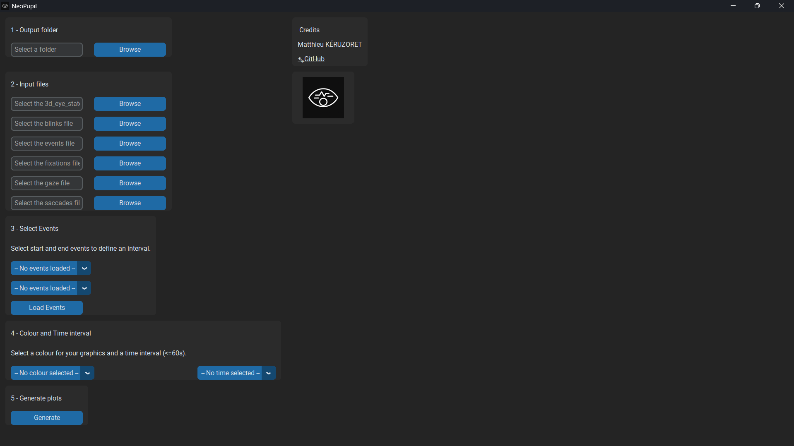

# GUI navigation guide

To avoid any bugs, please follow the procedure below:

**Output Folder:**  

- Choose the directory where generated plots will be saved.

**File Selection:**  

- Use the “Browse” buttons to load each required CSV file.  
- Ensure files correspond to the correct dataset type.

**Select Events:**  

- Click the “Load Events” button, then choose the start event and end event to create an interval of interest for analysis.

**Colour:**

- Choose the plotting colour in the list.

**Time:**  

- Set bin size in seconds for time-binned plots.

**Generate Plots:** 

- Click the “Generate” button to run the analysis and save plots.  
- A message box will confirm completion or display errors.
